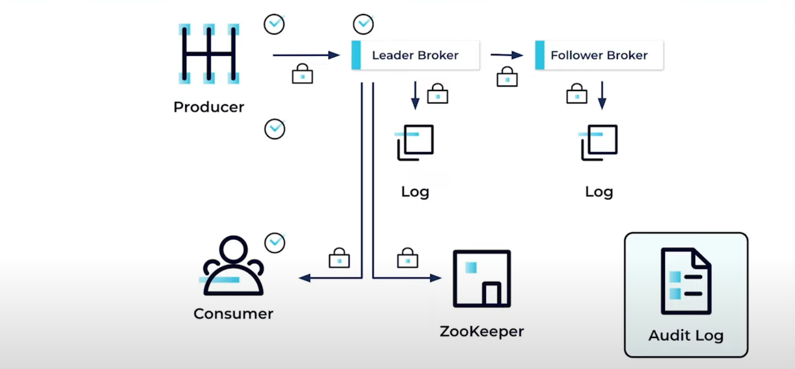
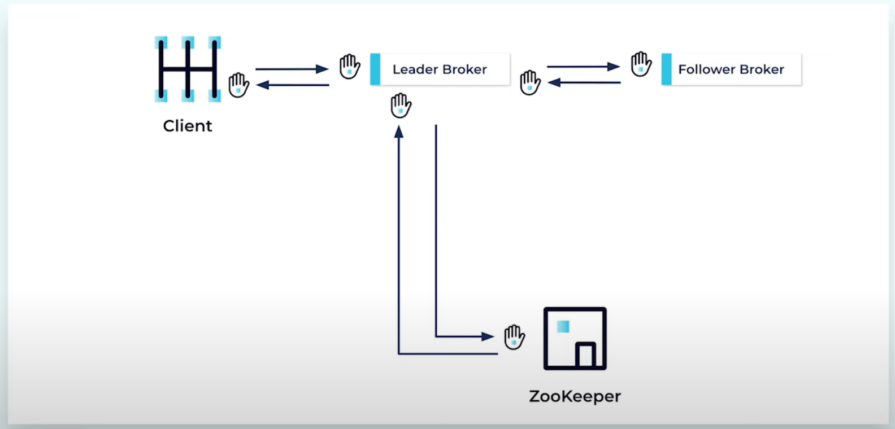
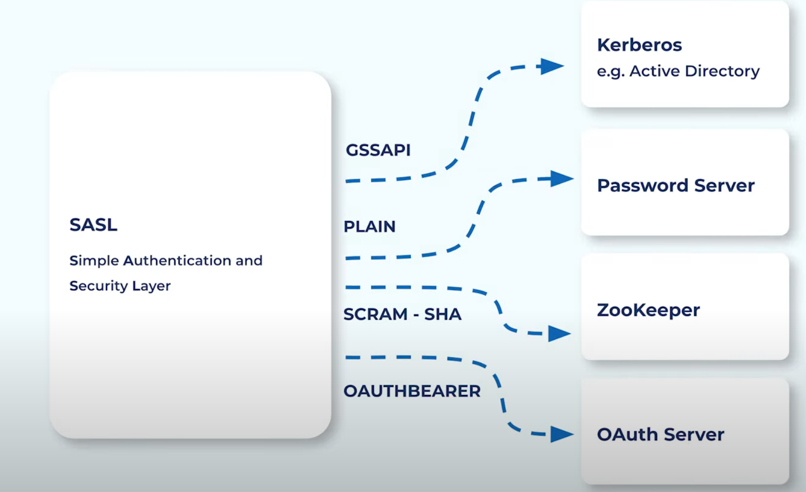
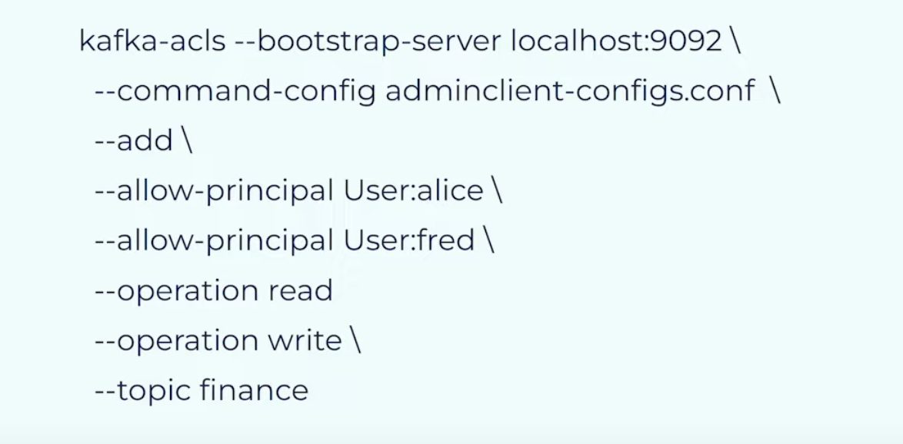
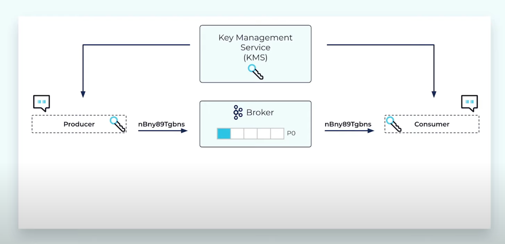

# Dataflow in Kafka
https://www.youtube.com/watch?v=wMg4m0icN5k&t=2s

# Kafka Security Considerations
- Encryption (SSL): data visibility
- Authentication (SSL & SASL): accessbility
- Authorisation (ACL): priviledges

# Secure Connection to Kafka Cluster
## Authentication Flows

## Broker configuration
- external listener: SASL_SSL
- internal listener: SSL
- broker listensers: SSL
## Secure Security Protocols
### SSL
TLS using CA certificates for 2 ways authentications when client opens connection to broker
- Confirm Broker's identity
- Broker confirm Client's Idenity: `ssl.client.auth=required`

Verify:
- hostname/endpoint: `inter.broker.listener.name == security.inter.broker.protocol`

### SASL_SSL
Simple authentication and Security layer

> ❗️**CONSIDERATIONS**:  
> - filesystem permissions to restrict access to files containing security information
> - avoid storing passwords in plaintext
> - use disk encryption or a secure credential store
> - change control

# Authorisation - Access Control Lists (ACLs)
## Create ACL
- with Zookeeper: ACLs is stored in Zookeeper

## Real-word principle names

# Encryption
✅ SSL certificates enable `secure data exchange`, protecting your data from eavesdroppers and prying eyes in transit.

> E.g. When a client connect to a Kafka cluster, it authenticates by sending the `username and password` packet to the cluster over the http network protocol. The data is visiable to all the servers that transfer the packet. Any router in the middle can view the packet. We must encrypt/decrypt the packet using SSL.

## Set up encryption
